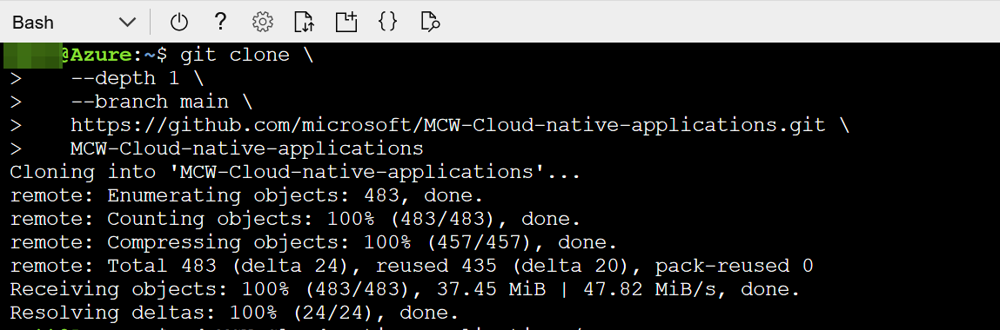
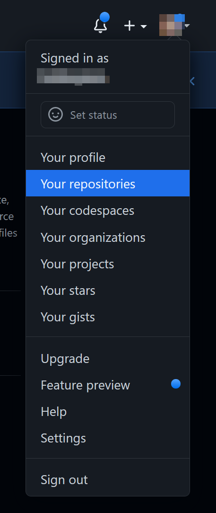
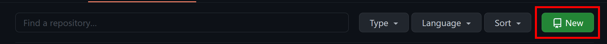
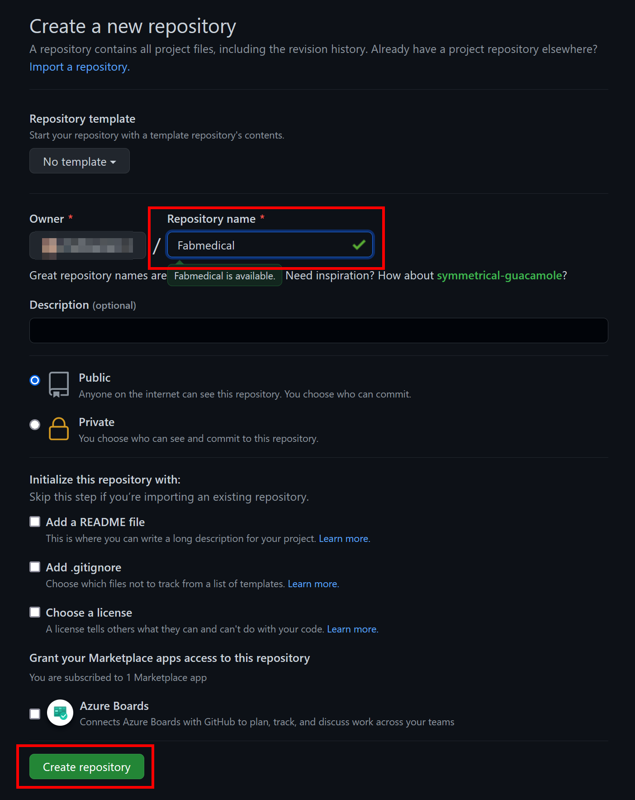
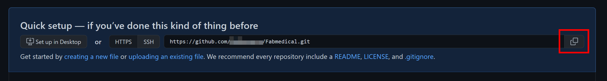
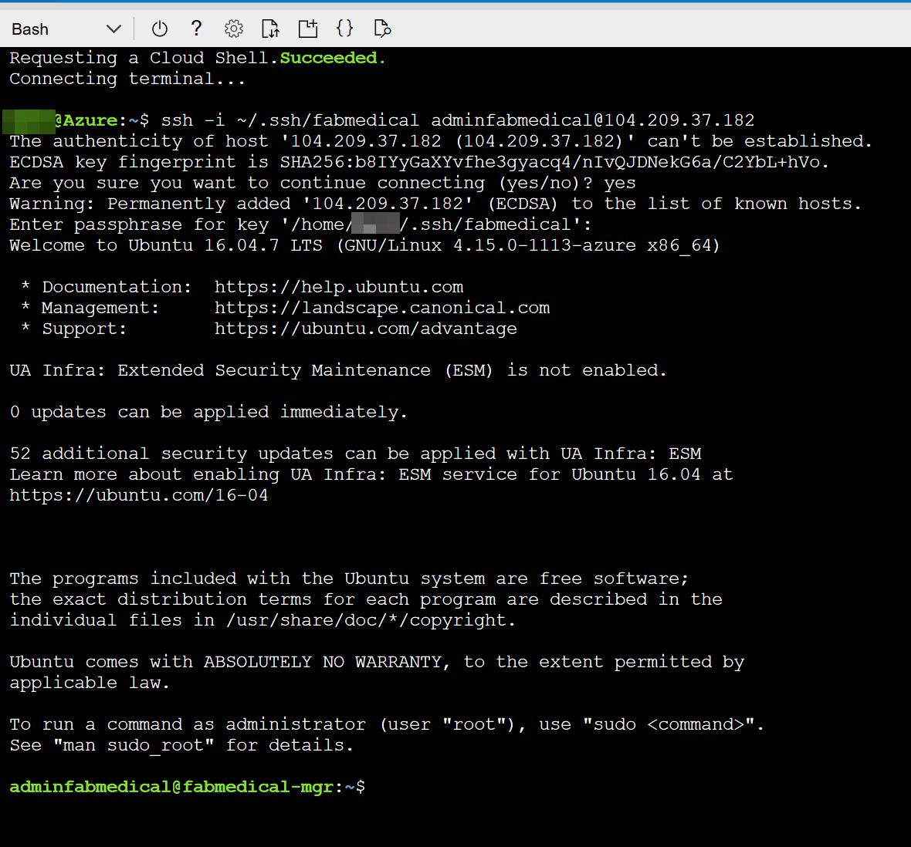
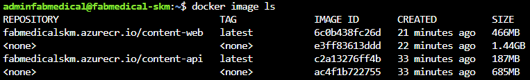
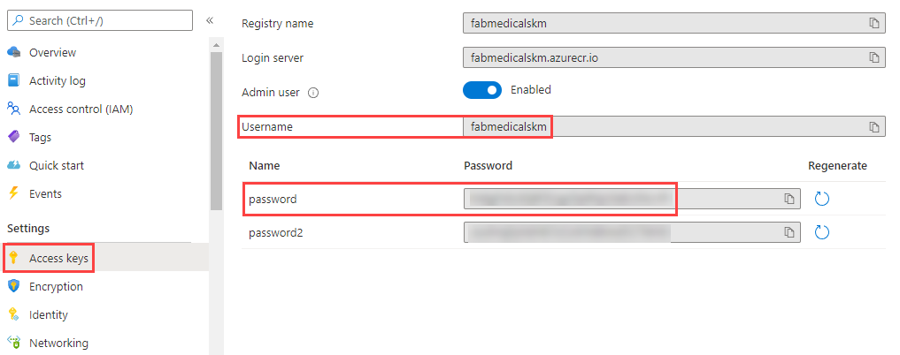

<div class="MCWHeader1">
Cloud-native applications
</div>

<div class="MCWHeader2">
Before the hands-on lab setup guide
</div>

<div class="MCWHeader3">
November 2021
</div>

Information in this document, including URL and other Internet Web site references, is subject to change without notice. Unless otherwise noted, the example companies, organizations, products, domain names, e-mail addresses, logos, people, places, and events depicted herein are fictitious, and no association with any real company, organization, product, domain name, e-mail address, logo, person, place or event is intended or should be inferred. Complying with all applicable copyright laws is the responsibility of the user. Without limiting the rights under copyright, no part of this document may be reproduced, stored in or introduced into a retrieval system, or transmitted in any form or by any means (electronic, mechanical, photocopying, recording, or otherwise), or for any purpose, without the express written permission of Microsoft Corporation.

Microsoft may have patents, patent applications, trademarks, copyrights, or other intellectual property rights covering subject matter in this document. Except as expressly provided in any written license agreement from Microsoft, the furnishing of this document does not give you any license to these patents, trademarks, copyrights, or other intellectual property.

The names of manufacturers, products, or URLs are provided for informational purposes only and Microsoft makes no representations and warranties, either expressed, implied, or statutory, regarding these manufacturers or the use of the products with any Microsoft technologies. The inclusion of a manufacturer or product does not imply endorsement of Microsoft of the manufacturer or product. Links may be provided to third party sites. Such sites are not under the control of Microsoft and Microsoft is not responsible for the contents of any linked site or any link contained in a linked site, or any changes or updates to such sites. Microsoft is not responsible for webcasting or any other form of transmission received from any linked site. Microsoft is providing these links to you only as a convenience, and the inclusion of any link does not imply endorsement of Microsoft of the site or the products contained therein.

© 2021 Microsoft Corporation. All rights reserved.

**Contents**

<!-- TOC -->

- [Cloud-native applications before the hands-on lab setup guide](#cloud-native-applications-before-the-hands-on-lab-setup-guide)
  - [Overview](#overview)
  - [Requirements](#requirements)
  - [Before the hands-on lab](#before-the-hands-on-lab)
    - [Task 1: Set up Azure Cloud Shell](#task-1-set-up-azure-cloud-shell)
    - [Task 2: Download Starter Files](#task-2-download-starter-files)
    - [Task 3: Create a GitHub repository](#task-3-create-a-github-repository)
    - [Task 4: Set up Azure Cloud Shell environment](#task-4-set-up-azure-cloud-shell-environment)
    - [Task 5: Complete the build agent setup](#task-5-complete-the-build-agent-setup)
    - [Task 6: Build Docker Images](#task-6-build-docker-images)

<!-- /TOC -->

# Cloud-native applications before the hands-on lab setup guide

## Overview

Before the hands-on lab, you will need to prepare the environment by deploying the database and the application locally on a virtual machine using Docker and MongoDB. You will also need to fork the GitHub repository containing the lab to your own GitHub account to be able to set up the CI/CD pipeline.

## Requirements

1. Microsoft Azure subscription must be pay-as-you-go or MSDN.

   - Trial subscriptions will _not_ work.

   - To complete this lab setup, ensure your account includes the following:

     - Has the [Owner](https://docs.microsoft.com/azure/role-based-access-control/built-in-roles#owner) built-in role for the subscription you use.

     - Is a [Member](https://docs.microsoft.com/azure/active-directory/fundamentals/users-default-permissions#member-and-guest-users) user in the Azure AD tenant you use. (Guest users will not have the necessary permissions.)

   - You must have enough cores available in your subscription to create the build agent and Azure Kubernetes Service cluster in [Task 5: Deploy ARM Template](#Task-5-Deploy-ARM-Template). You'll need eight cores if following the exact instructions in the lab, more if you choose additional agents or larger VM sizes. Execute the steps required before the lab to see if you need to request more cores in your sub.

2. An account in Microsoft [GitHub](https://github.com).

3. Local machine or a virtual machine configured with:

   - A browser, preferably Chrome for consistency with the lab implementation tests.

4. You will be asked to install other tools throughout the exercises.

## Before the hands-on lab

**Duration**: 60 minutes

You should follow all the steps provided in this section _before_ taking part in the hands-on lab ahead of time as some of these steps take time.

### Task 1: Set up Azure Cloud Shell

1. Open a cloud shell by selecting the cloud shell icon in the menu bar.

   

2. The cloud shell opens in the browser window. Choose **Bash** if prompted or use the left-hand dropdown on the shell menu bar to choose **Bash** from the dropdown (as shown). If prompted, select **Confirm**.

   

3. Make sure to set your default subscription correctly. To view your current subscription type:

   ```bash
   az account show
   ```

   

4. If the subscription displayed in the previous step is not the subscription you plan on using for this workshop, you will need to set the current subscription to your desired subscription. To set your default subscription to something other than the current selection, type the following, replacing {id} with the desired subscription id value:

   ```bash
   az account set --subscription {id}
   ```

   > **Note**: If you do not know the id of your desired subscription, you can list the subscriptions available to you along with their ids via the following command:

   ```bash
   az account list
   ```

   

### Task 2: Download Starter Files

> **Note**: You will need access to your Azure subscription via Azure Cloud Shell to proceed further in the workshop.  If you don't have a cloud shell available, refer back to [Task 1: Set up Azure Cloud Shell](#task-1-set-up-azure-cloud-shell) for set up instructions.

1. Check out the starter files from the MCW Cloud-native applications GitHub repository and detach them from the existing remote repository via the following commands:

   ```bash
   cd ~
   git clone \
      --depth 1 \
      --branch main \
      https://github.com/microsoft/MCW-Cloud-native-applications.git \
      MCW-Cloud-native-applications
   cd MCW-Cloud-native-applications
   ```

   > **Note**: If you do not have enough free space, you may need to remove extra files from your Cloud Shell environment.  Try running `azcopy jobs clean` to remove any `azcopy` jobs and data you do not need.

   

### Task 3: Create a GitHub repository

FabMedical has provided starter files for you. They have taken a copy of the websites for their customer Contoso Neuro and refactored it from a single node.js site into a website with a content API that serves up the speakers and sessions. This refactored code is a starting point to validate the containerization of their websites. Use this to help them complete a POC that validates the development workflow for running the website and API as Docker containers and managing them within the Azure Kubernetes Service environment.

1. Open a web browser and navigate to <https://www.github.com>. Log in using your GitHub account credentials.

2. In the upper-right corner, expand the user drop-down menu and select **Your repositories**.

    

3. Next to the search criteria, locate and select the **New** button.

    

4. On the **Create a new repository** screen, name the repository **Fabmedical** and select the **Create repository** button.

    

5. On the **Quick setup** screen, copy the **HTTPS** GitHub URL for your new repository, paste this into notepad for future use.

    

### Task 4: Set up Azure Cloud Shell environment

1. A GitHub personal access token (PAT) with appropriate permissions is required to set up and complete this lab - [Follow this link](https://github.com/settings/tokens/new?scopes=repo&description=GitHub%20Secrets%20CLI) to quickly set up a GitHub personal access token with the required permissions. Save the obtained PAT as it will be needed by future steps.

2. Set the following environment variables in an Azure Cloud Shell terminal.

   ```bash
   export MCW_SUFFIX=<SUFFIX>                   # Needs to be a unique three letter string
   export MCW_GITHUB_USERNAME=<GITHUB USERNAME> # Your Github account username
   export MCW_GITHUB_TOKEN=<GITHUB PAT>         # A personal access token for your Github account
   ```

   > **Note**: The following environment variables can also be set if their defaults are not appropriate for the lab setting or environment.

      - MCW_GITHUB_URL - Defaults to `https://github.com/$MCW_GITHUB_USERNAME/Fabmedical`
      - MCW_PRIMARY_LOCATION - Defaults to `northeurope`
      - MCW_PRIMARY_LOCATION_NAME - Defaults to `North Europe`
        - Note that the value needs to be placed in quotes (e.g. `export MCW_PRIMARY_LOCATION_NAME="West US"`)
      - MCW_SECONDARY_LOCATION - Defaults to `westeurope`
      - MCW_SECONDARY_LOCATION_NAME - Defaults to `West Europe`

   > **Note**: If you run into the error below, you may have to either use a different regional pair or increase your regional core quotas in your current regions. This lab's cloud resources require at least eight available cores in your regional core quota. An up to date list of Azure Region Pairs can be found at [this link](https://docs.microsoft.com/en-us/azure/best-practices-availability-paired-regions#azure-regional-pairs "Azure Region Pairs").

      ```bash
      {"error":{"code":"InvalidTemplateDeployment","message":"The template deployment 'azuredeploy' is not valid according to the validation procedure. The tracking id is '3d4adbc2-647b-4741-8d98-fe20495e0541'. See inner errorsfor details.","details":[{"code":"QuotaExceeded","message":"Provisioning of resource(s) for container service fabmedical-??? in resource group fabmedical-??? failed. Message: {\n  \"code\": \"QuotaExceeded\",\n  \"message\": \"Provisioning of resource(s) for container service fabmedical-??? in resource group fabmedical-??? failed. Message: Operation could not be completed as it results in exceeding approved Total Regional Cores quota. Additional details - Deployment Model: Resource Manager, Location: eastus, Current Limit: 10, Current Usage: 8, Additional Required: 4, (Minimum) New Limit Required: 12. Submit a request for Quota increase at https://aka.ms/ProdportalCRP/#blade/Microsoft_Azure_Capacity/UsageAndQuota.ReactView/Parameters/%7B%22subscriptionId%22:%228c924580-ce70-48d0-a031-1b21726acc1a%22,%22command%22:%22openQuotaApprovalBlade%22,%22quotas%22:[%7B%22location%22:%22eastus%22,%22providerId%22:%22Microsoft.Compute%22,%22resourceName%22:%22cores%22,%22quotaRequest%22:%7B%22properties%22:%7B%22limit%22:12,%22unit%22:%22Count%22,%22name%22:%7B%22value%22:%22cores%22%7D%7D%7D%7D]%7D by specifying parameters listed in the ‘Details’ section for deployment to succeed. Please read more about quota limits at https://docs.microsoft.com/en-us/azure/azure-supportability/regional-quota-requests. Details: \"\n }. Details: "}]}}
      ```

2. Run the `create_azure_resources.sh` script in the `MCW-Cloud-native-applications` repository that was cloned in a previous step. This will provision all of the Azure cloud resources necessary to execute the workshop.

   ```bash
   cd ~/MCW-Cloud-native-applications/Hands-on\ lab/lab-files/developer/scripts
   bash create_azure_resources.sh
   ```

3. Upon successful execution of the `create_azure_resources.sh` script, a command for establishing an SSH session to the build agent VM should be present in the output.

   ```bash
   Command to create an active session to the build agent VM:

       ssh -i ~/.ssh/fabmedical adminfabmedical@<PUBLIC IP OF VM>
   ```

4. Use the SSH command output in the previous step to establish an SSH session to the build agent VM.  You should be presented with a prompt similar to the following:

   `adminfabmedical@fabmedical-SUFFIX:~$`

   

### Task 5: Complete the build agent setup

1. From an Azure Cloud Shell terminal, use the SSH command output from the previous task and start an active SSH session to the build agent VM.

2. Clone the FabMedical GitHub repository created in the previous task.

   ```bash
   git clone https://github.com/<GITHUB_USERNAME>/Fabmedical
   ```

3. Set the following environment variables in the active SSH session to the build agent VM. Use the same GitHub access token used in a previous task.

   ```bash
   export MCW_SUFFIX=<SUFFIX>                   # Needs to be a unique three letter string
   export MCW_GITHUB_USERNAME=<GITHUB USERNAME> # Your Github account username
   export MCW_GITHUB_TOKEN=<GITHUB PAT>         # A personal access token for your Github account
   ```

4. Run the `create_build_environment.sh` script to set up the build agent VM environment. This script installs necessary dependencies on the build agent VM and applies the configuration settings to the VM's environment necessary for proper execution of the workshop.

   ```bash
   cd ~/Fabmedical/scripts
   bash create_build_environment.sh
   ```

   > **Note**: Ignore any errors you encounter regarding the Docker client. That will be resolved after joining a new SSH session in the following steps.

5. After the script completes execution, type `exit` to exit the SSH session. We will need to join a new SSH session to ensure the docker environment on the build agent VM has completed set up.

   ```bash
   adminfabmedical@fabmedical-???:~/Fabmedical/scripts$ exit
   logout
   Connection to 20.123.9.212 closed.
   matt@Azure:~$ ssh -i ~/.ssh/fabmedical adminfabmedical@20.123.9.212
   matt@Azure:~$ ssh -i .ssh/fabmedical adminfabmedical@20.123.9.212
   Welcome to Ubuntu 16.04.7 LTS (GNU/Linux 4.15.0-1113-azure x86_64)

   * Documentation:  https://help.ubuntu.com
   * Management:     https://landscape.canonical.com
   * Support:        https://ubuntu.com/advantage

   UA Infra: Extended Security Maintenance (ESM) is not enabled.

   0 updates can be applied immediately.

   65 additional security updates can be applied with UA Infra: ESM
   Learn more about enabling UA Infra: ESM service for Ubuntu 16.04 at
   https://ubuntu.com/16-04

   Ubuntu comes with ABSOLUTELY NO WARRANTY, to the extent permitted by
   applicable law.

   New release '18.04.6 LTS' available.
   Run 'do-release-upgrade' to upgrade to it.


   Last login: Sat Dec  4 11:47:31 2021 from 23.100.27.176
   adminfabmedical@fabmedical-mgy:~$
   ```

6. After reestablishing an SSH session to the build agent VM, run the `create_and_seed_database.sh` script to create and seed the MongoDB database for use in the workshop.

   ```bash
   cd ~/Fabmedical/scripts
   bash create_and_seed_database.sh
   ```

### Task 6: Build Docker Images

1. Navigate to the `content-api` directory and build the `content-api` container image using the Dockerfile in the directory. Note how the deployed Azure Container Registry is referenced. Replace the `SUFFIX` placeholder in the command.

   ```bash
   cd ~/Fabmedical/content-api
   docker image build -t fabmedical[SUFFIX].azurecr.io/content-api:latest .
   ```

2. Repeat this step for the `content-web` image, which serves as the application front-end.

   ```bash
   cd ~/Fabmedical/content-web
   docker image build -t fabmedical[SUFFIX].azurecr.io/content-web:latest .
   ```

3. Observe the built Docker images by running `docker image ls`. The images were tagged with `latest`, but it is possible to use other tag values for versioning.

   

4. Log in to Azure Container Registry using `docker login fabmedical[SUFFIX].azurecr.io`. Fetch the credentials from the **Access keys** tab of the ACR instance in the Azure portal.

   

5. Push the two images you built.

   ```bash
   docker image push fabmedical[SUFFIX].azurecr.io/content-api:latest
   docker image push fabmedical[SUFFIX].azurecr.io/content-web:latest
   ```

You should follow all steps provided _before_ performing the Hands-on lab.
